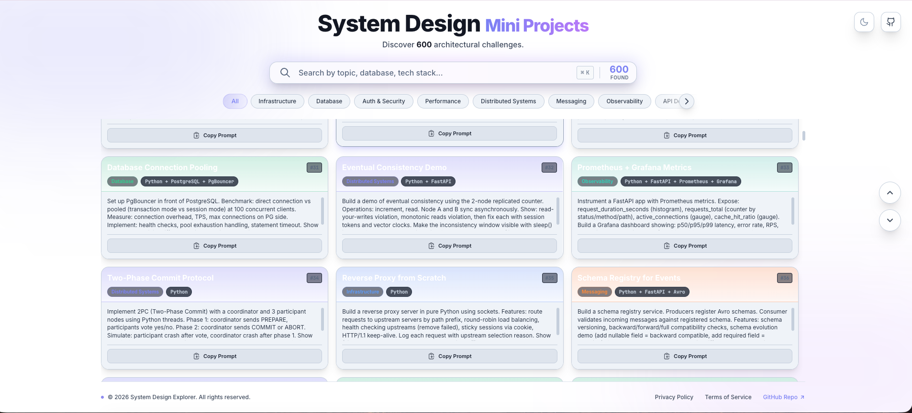

# System Design Mini Projects Explorer

A modern React-based web application for exploring system design mini projects with detailed prompts, stacks, and implementation guides.

## Features

✨ **Practical System Design Projects** - Each with detailed prompts and technology stacks  
🔍 **Advanced Search** - Full-text search across project titles, stacks, categories, and descriptions  
🏷️ **Smart Filtering** - Filter by 8 categories: Infrastructure, Database, Auth & Security, Performance, Distributed Systems, Messaging, Observability, and API Design  
📱 **Fully Responsive** - Works seamlessly on desktop, tablet, and mobile devices  
🎨 **Dark Mode Support** - Automatic theme based on system preferences  
📋 **Easy Copy** - One-click to copy full project prompts to clipboard  


## Project UI

Working Demo: https://69e4da5735eafe622c0bcca0--system-design-search-engine.netlify.app/



## Tech Stack

- **React 18** - UI library with hooks
- **TypeScript** - Type-safe code
- **Vite** - Lightning-fast build tool
- **CSS3** - Modern styling with CSS Grid and Flexbox

## Getting Started

### Prerequisites
- Node.js v16+ (v18 recommended)
- npm or yarn

### Installation

```bash
# Install dependencies
npm install

# Start development server
npm run dev

# Build for production
npm run build

# Preview production build
npm run preview
```

The development server opens automatically at `http://localhost:3000`

## Project Structure

```
src/
├── App.tsx              # Main React component
├── App.css              # Application styles
├── main.tsx             # Entry point
├── data.ts              # Project data and categories
└── components/
    ├── SearchBar.tsx    # Search input component
    ├── FilterButtons.tsx # Category filter buttons
    └── ProjectCard.tsx  # Individual project card
index.html               # HTML template
vite.config.ts          # Vite configuration
tsconfig.json           # TypeScript configuration
package.json            # Dependencies and scripts
```

## Available Projects by Category

### Infrastructure & DevOps (50+ projects)
- Kubernetes operators
- Service mesh patterns
- Distributed cron schedulers
- Feature flag services
- Blue-green deployments
- And more...

### Database (50+ projects)
- Database migrations
- Read replicas & routing
- Sharding strategies
- Query optimization
- Time-series ingestion
- And more...

### Auth & Security (50+ projects)
- Multi-factor authentication
- OAuth2 servers
- JWT token management
- Encryption & key rotation
- OWASP Top 10 mitigations
- And more...

### Distributed Systems & Consensus (50+ projects)
- Circuit breaker patterns
- Event sourcing & CQRS
- Saga patterns
- Distributed locks
- Leader election
- And more...

## Usage

1. **Search** - Type to find projects by name, technology, or description
2. **Filter** - Click category buttons to narrow results
3. **Explore** - Click any project card to expand and see full details
4. **Copy** - Click "Copy prompt" button to copy the project specification
5. **Build** - Use the prompt with your favorite language/framework to build the POC

## Each Project Includes

- **Project ID & Title** - Unique identifier and descriptive name
- **Tech Stack** - Recommended technologies and frameworks
- **Category** - Organized by system design domain
- **Detailed Prompt** - Complete specification with:
  - What to build
  - Implementation details
  - Key concepts to demonstrate
  - Real-world context
  - Comparison with alternatives

## Building Projects

Every project is designed to be a complete proof-of-concept (POC) that:
- Teaches foundational concepts
- Includes practical implementation details
- Can be built in 4-8 hours
- Provides hands-on experience
- Connects theory to practice

## Example Projects

### #1: Database Migration Framework
Build a Python CLI tool mimicking Alembic with version tracking, migration file generation, dependency graphs, and schema diff detection.

### #6: Circuit Breaker Pattern
Implement from scratch with CLOSED/OPEN/HALF_OPEN states, showing failure handling and recovery patterns.

### #11: CQRS + Event Sourcing
Build a bank account system with event-driven architecture, event replay, and materialized views.

## Learning Path

Suggested progression:
1. **Foundation** (Projects 1-50) - Core patterns and basic implementations
2. **Intermediate** (Projects 51-100) - More complex patterns and distributed concepts
3. **Advanced** (Projects 101-150) - Production-grade patterns and scaling
4. **Expert** (Projects 151-200) - Complex observability, edge cases, and optimization

## Development

### Commands

```bash
# Start dev server with HMR
npm run dev

# Type check
npx tsc --noEmit

# Build production bundle
npm run build

# Preview production build locally
npm run preview
```

### Customization

- **Add new projects**: Edit `src/data.ts` and add entries to the `PROJECTS` array
- **Modify styling**: Edit `src/App.css` (CSS variables for theming)
- **Change categories**: Update `CATEGORIES` object in `src/data.ts`

## Performance

- **Gzipped size**: ~56KB (JS), ~1.4KB (CSS)
- **Search**: Real-time search with useMemo optimization
- **Dark mode**: System preference detection with CSS variables

## Browser Support

- Chrome/Edge 90+
- Firefox 88+
- Safari 14+
- Mobile browsers (iOS Safari, Chrome Android)

## License

MIT

## Contributing

Feel free to:
- Add more projects
- Improve existing prompts
- Enhance UI/UX
- Fix bugs
- Suggest improvements

## Resources

- [System Design Interview](https://github.com/donnemartin/system-design-primer)
- [System Design Cheatsheet](https://gist.github.com/vasanthk/485d1c25737e8e72759f)
- [Designing Data-Intensive Applications](https://dataintensive.net/)

---

**Made to help engineers learn system design through hands-on practice.**
